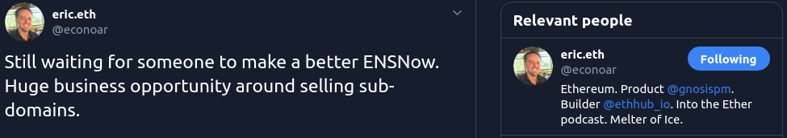
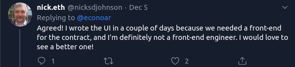
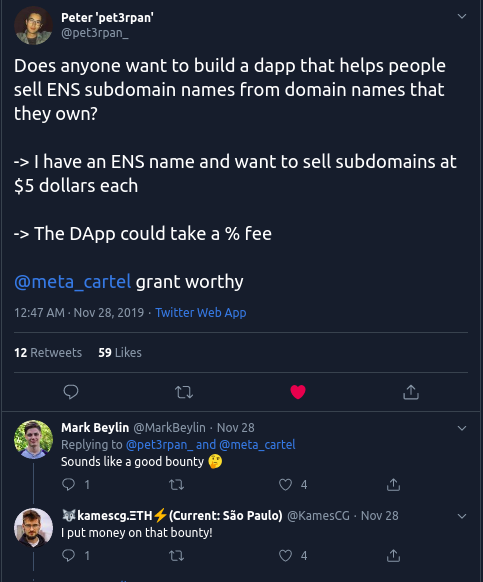

Link: http://ens-market.herokuapp.com/

## ENS-MarketPlace

### Table of contents

- [General info](#general-info)
- [Screenshots](#screenshots)
- [Features](#features)
- [Status](#status)
- [Inspiration](#inspiration)
- [Contact](#contact)

### General info
> We have built an ENS Marketplace where anyone can search, buy, sell their ENS subdomains. 

### Screenshots

### Features
* Management dashboard for listed (sold/unsold) subdomains for the Domain Owner.
* Let subdomain owner submit the authority of their domain, fix a price for their subdomain and sell it.
* A Sub Domain Leaderboard / stats page
* Filtering Options for Subdomains. (By Price, By Popularity, By subdomain name) 
* Add Favourites

### Status

Project is: _in progress_

### Inspiration

[Eric](https://twitter.com/econoar) Founder@EthHub 

[Nick](https://twitter.com/nicksdjohnson) Founder@ENS

[Peter](https://twitter.com/pet3rpan_) Founder@Metacartel

### Creators

- [@CryptoCrat](https://twitter.com/CryptoCrat7)
- [@rekspero](https://twitter.com/mitramukh)
- [@Man-Jain](https://twitter.com/manankpatni)
* feel free to contact us!
